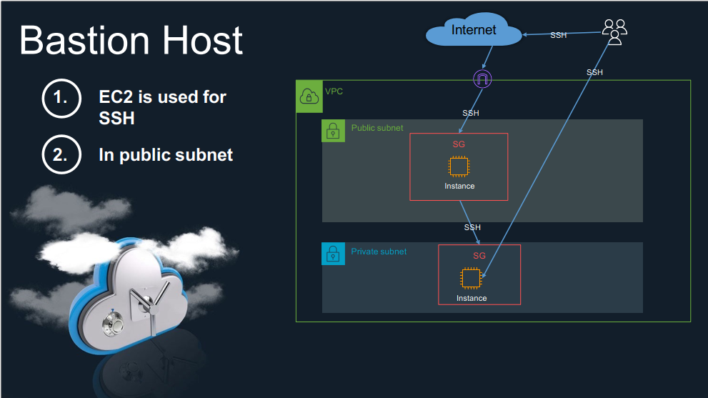

# Bastion Host [EC2 used for ssh]
-   In Public Subnet
-   In Private Subnet

-   You have to create AWS EC2s and SSH to it one in public subnet and another in private subnet
-   

## Ans:

-  1- create VPC
    -   name => demo
    -   CIDR => 10.0.0.0/16
    
-   2- create Subnets from vpv
    -   Choose VPC
    -   private
        -   name => private
        -   CIDR => 10.0.1.0/24
    -   public
        -   name => public
        -   CIDR => 10.0.2.0/24
-   3-  Create INSTANCES
    -   name => public
    -   os image => Amazon linux
    -   vpc => select vpc and subnet public
    -   assign public ip => yes
    -   Keypair => create keypair and assign to it
    -   Launch Instance
     -   Create Internet Gateway and assign to this vpc
    -   Create Route table private and assign to vpc (subnet association public)
        -   Edit routes choose distnation(0.0.0.0/0) => target choose internet gateway i created
    - Finally can ssh to instance
    -   

-   4-  Create INSTANCES
    -   name => private
    -   os image => Amazon linux
    -   vpc => select vpc and subnet private
    -   assign public ip => disabled
    -   Keypair => create keypair and assign to it
    -   Launch Instance

    -   copy keypair in public ec2 
    -   create Nat Gateway
        -   name => demo
        -   choose public subnet
        -   Allocate Elastic IP

    -   subnet association connect route table with subnet private
    -   Edit routes choose distnation(0.0.0.0/0) => target choose Nat gateway i created

    - Finally can ssh to instance
    -   
