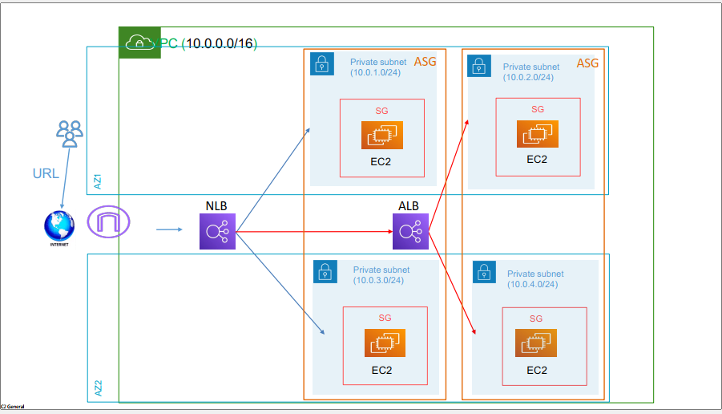

#   Auto Scaling Group with ALB & NLB

-   

-   Auto Scaling Group
-   Create ASG
    -   name => asg
    -   Create a Launch template
        -   name => mytemplate
        -   os image => Amazon linux
        -   instance type => t2.micro
        -   keypair select
        -   create security group
            -   name => asg-sg
            -   select vpc
            -   open http 
            -   open ssh
        -   run shell script in boot of instance

        ```bash

        #!/bin/bash
        # Use this for your user data (script from top to bottom)
        # install httpd (Linux 2 version)
        yum update -y
        yum install -y httpd
        systemctl start httpd
        systemctl enable httpd
        echo "<h1>Hello World my name is mostafa hussien from $(hostname -f)</h1>" > /var/www/html/index.html

        
        ```

    -   create lanuch template
-   Select template
-   next and choose vpc and public subnet
-   next and load balancing => attach new load balancer
    -   select application load balancer
        -   name => alb
        -   scheme => internet facing
        -   select vpc
        -   create target group
            -   name => asg-alb-tg
            -   turn on elastic load balancer
        -   next and configure size and scaling desire 2 ,  min 1, max 3
        -   next and add notification
            -   create topic
                -    choose standard
                -   name => mytopic
            -   create subscibtion to connect topic with email
                -   protocol => email
                -   End point => moustafa.hussieen@gmail.com
                -   create subscribtion
            -   select topic
        -   next and create auto scaling group
    -   finally will create two instances if one of them down will another will provisiong in mill seconds
-   


-   create Auto Scaling group- Network Load balancer
    -   select template
    -   next vpc and subnet
    -   Attach new load balancer
        -   Network load balancer
            -   name => asg-nlb
            -   internet facing
            -   create target group
                -   asg-nlb-tg
                -   turn on elastic load balancer
                -   next scaling  desire 2, min 1, max 3
                -   next add notification
                -   select topic
-   create
-   
-   
-   


-   connect NLB to ALB
    -   in load balancer in listner => add listener
        -   create target group
            -   application load balancer
            -   name => nlb-to- alb
            -   next select alb
            -   create tg
    -   select tg
-   port 81 and slect tg => listner lisyen port 81 any request 81 go to alb

-   


            


            


