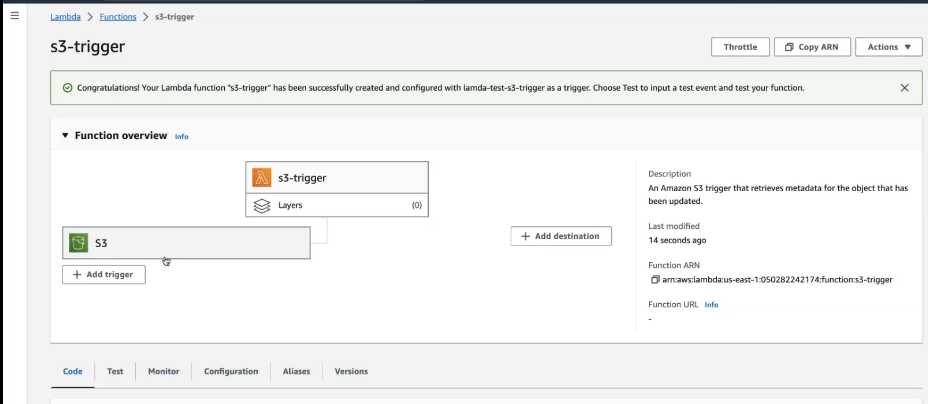

#   Trigger Lambda by S3

-   

-   Lambda function
    -   create
    -   use a blueprint
    -   blueprint name => Get S3 object
    -   function name => s3-trigger
    -   execution role =>
        -   create a new role with basic lambda permissions
-    Got to S3 and create bucket
    -   name => lamda-bucket
    -   create
-   -   go to lambda and select bucket
    -   Events types
        -   All object create events
    -   will create code
    -   
-   configration of lambda fun 
    -   add permission of s3
        -   attach polices
        -   search Amazon s3 readonly access
        -   add permission

-   

-   Add email that file sucessfulyy uploaded
    -   click add distnation from lambda fun trigger
        -   condtion => on success
        -   select topic
        -   save

-   -   

-   1-upload file  s3 bucket

-   

-   2-will send email and logs

-   -   
