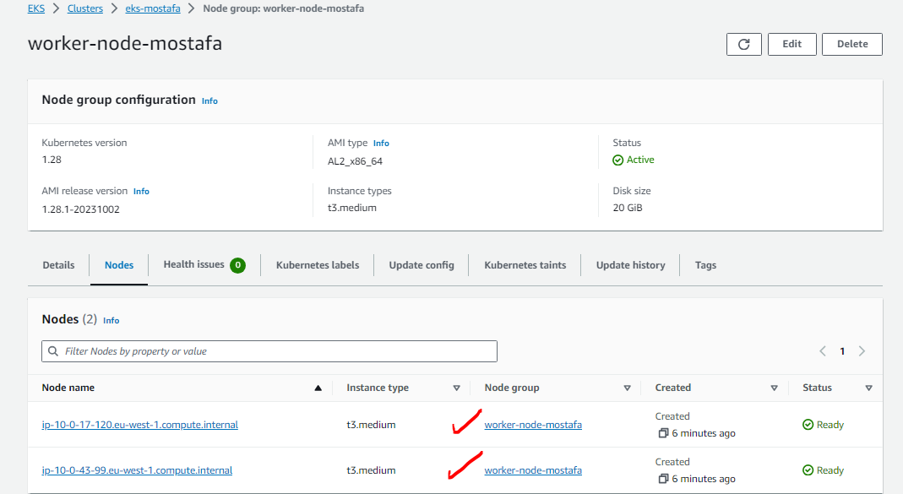

# EKS Cluster with two Node
# Create Deployment access NodePort, Loadbalancer

-   go to EKS
-   Add cluster
-   -   name => eks
    -   select kubernets version
    -   cluster service role => eksclusterrole
        -   throw docs follow steps and choose eks
        - go to iam
        -   choose role
        -   choose eksclusterrole
    
    -   next and select vpc and subnets
    -   attach to secuirty group
    -   cluster endpoint
        -   choose public
    -   next next - add-ons
    -   create eks cluster
    -
    -   

-   go to eks cluster
    -   add node group
    -   -   name => worker-nodes
        -   node iam role => 
            -   go to iam from docs and create eks  assign to it three policy
                1-AmazoneEKSWorkerNodePolicy
                2-AmazonEC2ContainerRegistryReadOnly
                3-AmazonEKS-CNI-Policy
        -   next node group comput configuration
            -   instances type => t3.medium
        -   dsire 2, min 2, max 2
        -   next and select subnet
        -   create node group


-   from eks =>  compute you can view worker node

-   

-   


-   From Cloud Shell you can connect cluster
    -   to update kube config file => api endponit and certficate authority

          ```bash
          aws eks update kubeconfig --region  region-code --name my-cluster
          ```
    -   
-  
-   install application in kubernetes
    1-emprative command

        ```bash
        kubectl create deploy nginx --image nginxdemos/hello --replicas 4
        kubectl expose deploy nginx --port 80
        ```
    2- yaml file
        ```bash

        kubectl apply -f postgres-deploy.yaml
        kubectl apply -f redis-deploy.yaml
        kubectl apply -f voting-app-deploy.yaml
        kubectl apply -f worker-app-deploy.yaml
        kubectl apply -f redis-deploy.yaml

        kubectl apply -f postgres-service.yaml
        kubectl apply -f  redis-service.yaml
        kubectl apply -f result-app-service.yaml
        kubectl apply -f voting-app-service.yaml
    
        ```
-   


